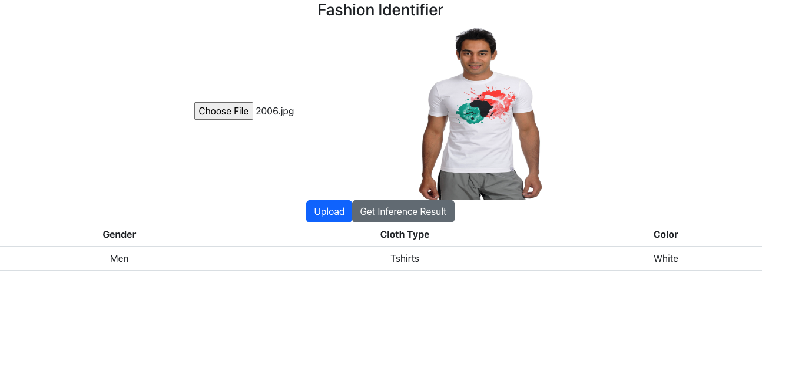

# Fashion Project!

Used [this](https://www.kaggle.com/code/pavelgot/items-classification-pytorch/data) dataset.

For the React & Node.js webapp, go to [this]() link.

This repository contains the code that I used to preprocess the above dataset, training the model using PyTorch, and functions to parse model output.

When given an image with a clothing, the ML model returns the predicted gender, cloth type, and color of the cloth in the image.

There are 5 categories for gender (Men, Women, Boys, Girls, Unisex), 40 categories for cloth type, and 21 categories for color.

